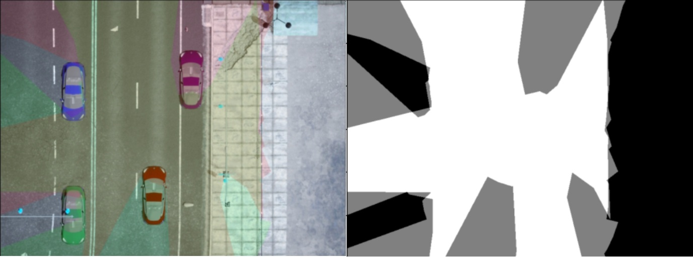

# Heatmap_event

## Problem:

Occlusion by other road agents like vehicles can negatively affect road safety. Consider the situation in the following figure: another car is blocking the car at the back from viewing a pedestrian. To cope with this problem, communication between vehicles (V2V) and communication between vehicles and infrastructure (V2I), like a Roadside Unit (RUD), can be utilized to provide information on the whole scene. Even with such technology, parts of the road will be invisible to both cars. Thus, we can define a confidence zone that covers the visible area for each vehicle. By combining the confidence zones for all intelligent cars, a heatmap can be generated in which each location will have a value ranging between 0 (for total invisible areas) to 1 (for areas visible by two vehicles at least).


## Scenario:

Consider a scenario of two intelligent vehicles, A and B, as shown in the following image. Vehicle A is blocking a pedestrian from vehicle B. Both cars use lidar to sense the surroundings. The other two vehicles do not have sensors or communication capabilities.


## challenge

1. The Design Challenge: Design a vehicle dashboard to increase road safety, incorporating the concept of a confidence zone and the visibility heatmap.
2. The Programming Challenge: generate the confidence zone for each vehicle and combine them into a heatmap.


# information 

1. Use Figma in the Design Challenge. If you need inspiration to start, check this [page](https://github.com/user-attachments/assets/efe2da13-8fc3-4bd8-8a9f-2867577ed3d)
   
2. For the programming challenge
   * Lidar data, aerial view, and a metadata file are in the [data](/data/) folder
     
   * Use The following code to read the Lidar (ply) files
     ```python
     # Data read & write
     import numpy as np
     # Visualization
     import open3d as o3d #pip install open3d   ## to install
     # Load ply file
     pc_ply = o3d.io.read_point_cloud(ply_file_path)
     print('PLY file loaded')
     # get a number array of the point cloud
     points= np.asarray(pc_ply.points)                     # three columns (X, Y, Z) in meters relative to the lidar location
     #generate the distance from the lidar and angles
     angles=np.atan2(points[:,1],points[:,0])*180/np.pi    # angle in degree
     distance=(points[:,1]**2+points[:,0]**2)**0.5         # in meters
     ```
     
     
     
   * for each lidar ply, mark the triangle marked by **points[i]**,**points[i+1]**, and **(0,0)** as a confident zone if
     * the Z coordinate is less than -1 for **points[i]** and **points[i+1]**
     * the distances, **distance[i]** and **distance[i+1]** are less than 30  meters
     * **0 < angles[i+1] - angles[i]  < 1.25 * delta_angle**  ( delta_angle=360/52)

   *  Combine the confidence zones into a single heatmap
     
     


